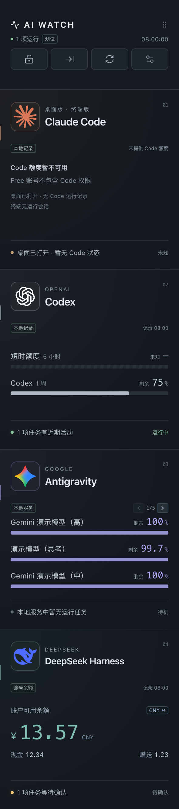
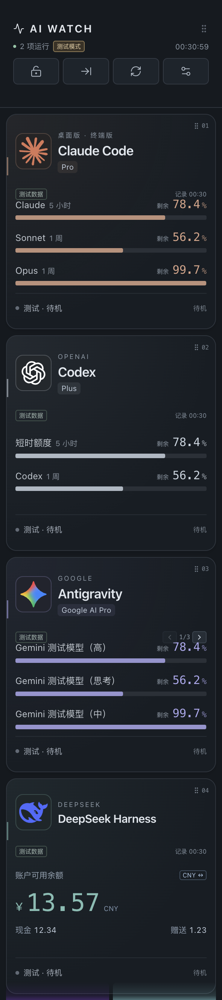
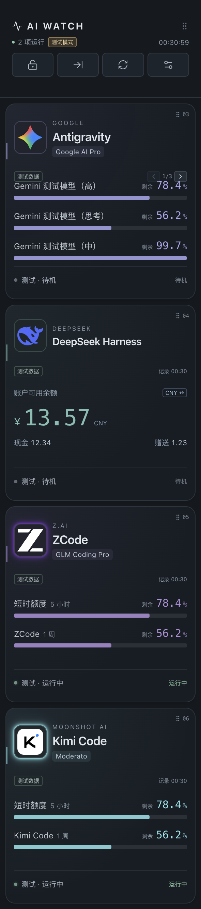
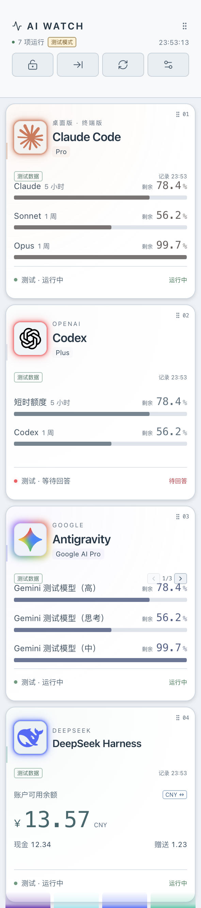
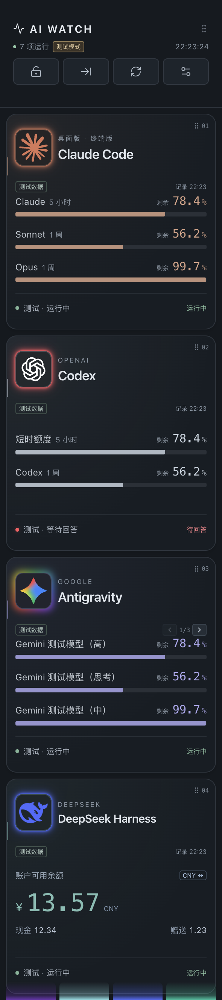
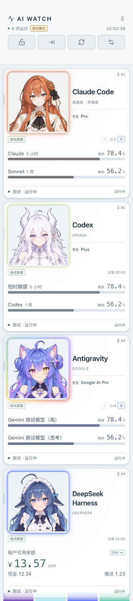
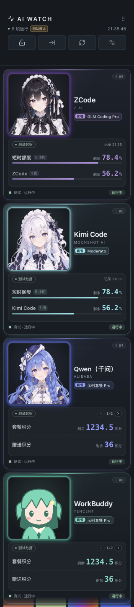
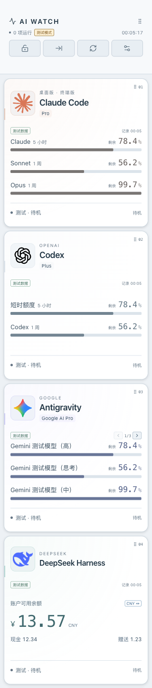
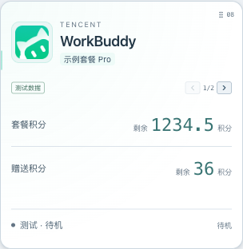

# AI Watch

macOS 上的 AI 工具监看面板。使用 **Electron + React + TypeScript + Vite**，预留 Windows、Linux 的构建入口。

> v0.18.0 修复异常渲染进程残留与 Codex 状态流的大量重复拷贝，暂停不可见动画；新增 Claude Desktop / Code 来源切换、桌面套餐与活动识别，并修正 Antigravity 耗尽额度显示。保留全屏横向额度行与任务详情、双排、17 种语言和二次元模式。



文档截图使用合成测试数据，顶部或卡片标有“测试”，不包含真实账户数据。

新增额度预览：[官方窗口与合并模型](docs/screenshots/quotas-online-merged.png)、[Codex 历史数字](docs/screenshots/codex-quota-history.png)。

## 界面

展开窗口的高宽比为 **4.5 : 1**，高度占满当前显示器的可用工作区域，默认贴右边。可用区域会避开系统菜单栏与 Dock。尺寸按逻辑像素计算，由系统自动处理 HiDPI 缩放。

顶部控制栏保持固定，下方工具模块采用 14px 圆角矩形，一屏可完整显示四张。卡片左右距离窗口边缘各 8px，卡片之间、顶部控制栏下方及窗口底部保留 8px 间距。尺寸均为逻辑像素，在 HiDPI 下自动缩放；扣除间距后，首屏五个区域仍按 **0.5 : 1 : 1 : 1 : 1** 分配。超过四个模块时仅下方卡片区域滚动；少于四个时保留卡片高度：

| 区域 | 内容 |
| --- | --- |
| 控制栏 | 锁定、收起、刷新、配置，本地运行任务数与检查时间 |
| Claude（Desktop / Code） | 可切换来源；匹配当前账号的套餐、额度快照和对应客户端活动；未知信息明确标注 |
| Codex | 助手图片、官方账号额度 / 本地后备记录、近期任务活动指示灯 |
| Antigravity | 助手图片、本地模型额度分页、当前任务指示灯 |
| DeepSeek Harness | 助手图片、账户可用余额、现金与赠送金额、任务活动及等待确认状态 |
| ZCode | 助手图片、BigModel 个人套餐与额度、经新活动证据确认的本地任务状态 |
| Kimi（Code / Work） | 可选择 Code 独立额度或 Work 会员共享积分；活动按所选来源读取 |
| Qwen（千问） | 助手图片、套餐、剩余积分 / 额度及可确认的本地活动 |
| WorkBuddy | 助手图片、套餐、各积分池剩余数量及本机任务状态 |

## 模块选择与屏幕外提醒

在 **配置 → 监看模块** 勾选需要显示的工具，允许启用任意 0～8 个。选择即时生效并保存，重启后保留；全部关闭时显示“选择监看模块”入口。旧版四 / 六模块顺序在升级后保留，新模块排在后面。已有关闭项继续关闭，非空选择会启用新加入的模块；全部关闭的选择仍保持为空。

- 超过四个时用鼠标滚轮、触控板或聚焦列表后的方向键上下滚动，顶部控制栏固定。
- 已启用的模块滚出视野后仍有运行或等待活动，会在窗口**底边内侧**显示对应颜色的 5 秒呼吸光带；多个模块同时活动时并列显示，点击光带定位到相应卡片。
- 卡片可见高度不足 60% 时视为屏幕外；Codex 待回答 / 待授权仍优先红色。设置打开、拖动排序或窗口收起时不显示底边提示；窄栏直接显示所有已启用模块的状态。
- 取消勾选的模块不显示、不提醒，也不计入顶部运行数；原顺序仍保留。勾选控制显示范围，后台只读状态检查仍继续，可见区域外的呼吸动画暂停。

 

设置预览：[模块勾选](docs/screenshots/module-selection.png)。截图使用合成测试数据，示例额度不代表实际账号。

## 外观与暗夜模式

默认开启 **跟随系统**，系统外观改变后面板会自动切换，无需重启；已有旧配置升级后也默认跟随系统。

在设置的“外观”区域：

- **跟随系统**：开启时自动使用系统的浅色或深色外观；关闭时固定当前外观。
- **暗夜模式**：可随时手动切换深色 / 浅色，同时关闭自动跟随。
- 外观选择立即生效并保存，关闭设置页后仍生效，重启后保留；其他配置仍使用“保存配置”按钮。

两种主题覆盖顶部、卡片、额度和余额、收起栏、测试选项与设置控件。LOGO 底板随外观调整，品牌呼吸灯、Codex 红色等待提醒、8px 间距和模块顺序保持一致。浏览器预览同样跟随系统，也可单独保存手动选择。

桌面版通过 [Electron nativeTheme](https://www.electronjs.org/docs/latest/api/native-theme) 读取与监听外观变化。当前在 macOS 验收；Windows / Linux 的实际系统联动待相应平台验证。

 

设置预览：[外观开关](docs/screenshots/theme-settings.png) · [浅色设置页](docs/screenshots/theme-settings-light.png)。以上预览均为合成测试数据。

## 点击图标打开应用

点击卡片图片或收起栏图片，即可打开或唤起对应桌面应用；也可用 Tab 聚焦图标，按 Enter / 空格打开。图标不再作为拖动排序区域。

- macOS 自动按应用身份识别 Claude、Codex、Antigravity、DeepSeek Harness、千问和 WorkBuddy，检查系统与用户应用目录及一层分类目录。
- 未找到时在 **配置 → 启动应用** 手动选择对应应用；ZCode、Kimi Code 当前使用这个入口；选择 Kimi Work 来源后可自动识别 Kimi 桌面应用。Code 与 Work 的手选启动目标分别保存。选择只保存启动目标，不会立即打开应用。
- Claude 图标打开 Claude 桌面应用；不会自动运行终端命令。仅安装 CLI 的工具需要先选择可打开的桌面应用。
- 自选启动位置只保存在本设备，换设备需重新选择。只允许原生应用 / 可执行程序，不接收网址或任意命令。
- 未安装、启动目标失效或打开失败时显示提示；收起状态会展开，以便看到处理方法。重复点击会被合并。
- 测试模式仅显示模拟提示，不打开真实应用；浏览器预览提示使用桌面版。

Windows / Linux 已准备手动选择可执行程序的入口，实际启动行为待对应平台验证。

## 二次元模式

在 **配置 → 外观 → 二次元模式** 开启，立即保存并在重启后保留。展开卡片的图片框约占模块面积四分之一，人物完整等比显示、不裁切；模式不会改变窗口比例、四卡首屏或滚动规则。

内置 Claude、Codex、Antigravity、DeepSeek、ZCode、Kimi 与千问角色图；其中 ChatGPT 图用于 Codex，Gemini 图用于 Antigravity，WorkBuddy 暂用角色占位图。普通 LOGO 与二次元图片各有独立的“替换”入口，切换模式不会覆盖另一套图片。

每张卡片自上而下分为三层，字号、间距与圆角按窗口宽度统一缩放：

| 区域 | 内容 |
| --- | --- |
| 角色区（约占卡片一半高度） | 方形角色画框完整显示人物；右侧依次为工具名称、来源和“套餐”标签，长名称在各自列内换行；右上角为排序序号 |
| 数据面板 | 内嵌浅底面板：来源胶囊与翻页 / 记录时间，下方为额度、积分或余额；额度进度条使用角色主题色渐变，低额度改用警示色 |
| 底部状态 | 状态点、任务说明与状态胶囊；运行为绿色，Codex 待回答 / 待授权为红色 |

卡片顶部带主题色细线与浅色渐变，浅色主题保留更多角色色彩。单卡示例：[空额度提示](docs/screenshots/anime-card-empty-dark.png)。二次元模式每页最多显示两项额度或积分，超出可翻页；套餐和底部任务状态仍完整显示。原有 5 秒呼吸灯、Codex 红色等待提示、屏幕外活动提醒和图标启动行为继续生效。收起栏使用同一套角色图，保持窄栏尺寸。二次元样式集中在 `src/anime.css`，只作用于二次元模式，普通模式布局不变。

 

## 模块排序

在任意工具卡片的拖动手柄、标题、额度文字或空白处 **按住约半秒（450ms）**，看到边框高亮后上下拖动，松开保存新顺序。其他卡片会随目标位置移位，顶部控制栏不参与排序。

- 直接点击或按住后立即滑动不会开始排序；LOGO 用于打开应用，长按 LOGO 不会排序。翻页、币种切换等按钮保持正常点击。
- 拖动中按 Esc，或窗口失去焦点、尺寸变化时取消操作，保留原顺序。
- 所有模块的顺序保存在本设备偏好中，重启后保留；收起窄栏、测试模式也使用同一顺序。改变停靠、锁定、动画配置不会重置顺序。
- 拖到卡片列表的上、下边缘时自动滚动，可将首张拖到第六张；关闭的模块保留原排序位置。
- 键盘可用 Tab 聚焦卡片，再按 Alt + ↑ / ↓ 调整位置。
- 顶部标题区域仍用于移动整个窗口，卡片拖动只调整模块位置。设置打开时继续停用底层窗口拖动区，避免遮挡开关。

浏览器预览的排序仅存于该浏览器。拖动示例：[卡片排序中](docs/screenshots/card-sorting.png)。

## LOGO 呼吸灯

运行任务时，LOGO 框外沿显示向外逐渐变暗的光晕，**每 5 秒完成一次亮灭**。展开面板与收起窄栏均显示，配置中的图片列表不闪烁。

| 工具 | 运行光晕 |
| --- | --- |
| Claude | 对应 LOGO 的橙色 |
| Codex | 浅橄榄绿色 |
| Antigravity / Google | 彩虹渐变循环流动；亮度仍按 5 秒呼吸 |
| DeepSeek Harness | 蓝色 |
| ZCode | 深紫色 |
| Kimi Code | 浅青色 |
| Qwen（千问） | 蓝色 |
| WorkBuddy | 青绿色 |

**Codex 待回答或待授权时优先显示红色光晕**，底部提示“待回答”“待授权”或“待处理”。同一客户端还有其他运行任务时仍优先亮红灯，顶部运行数保留那些正在工作的任务。处理请求后，下一轮状态更新恢复运行配色或熄灭。其余工具仅按运行状态点亮 LOGO；原有等待状态小圆点保持原有含义。

空闲、离线、未知不显示运行光晕。关闭“状态灯动画”或系统启用减少动态效果时，保留静态光晕以传达状态。

效果预览使用合成数据：[四种运行配色](docs/screenshots/glow-running.png) · [Codex 红色提醒](docs/screenshots/glow-attention.png)。

## 手动测试模式

打开 **配置 → 测试模式**，选择场景后点击“查看测试面板”。开关与场景即时生效，不需要保存；关闭设置不会退出测试模式。顶部“测试模式”标记可直接返回配置，收起窄栏中的“测试”按钮会展开窗口并打开配置。

- **快捷场景**：全部运行、全部待机、Codex 待回答、Codex 待授权。
- **各工具任务状态**：独立选择运行、待机、等待确认、未知、离线。Codex 另有待回答、待授权、等待与其他任务同时运行，用于检查红灯优先级与运行计数。
- **额度显示**：正常、低额度 12.5%、耗尽 0%、满额 100%、未知、过时；Claude 另有 Free 无 Code 额度。Antigravity 提供七项测试额度，普通模式三页、二次元模式四页，可检查末页与长名称。
- **套餐 / 积分**：千问和 WorkBuddy 提供套餐、四个合成积分 / 次数池与分页；支持正常、低值、零值、未知、历史、未登录及读取失败。未知值显示横线，历史值明确标为历史，积分不会转换为货币。
- **Harness 余额**：正常 CNY / USD 双币种、零余额、小于 0.01 的金额、历史余额、未登录、未知和读取失败；点击币种按钮检查切换。
- **窗口与控件**：沿用面板上的锁定、收起、展开、刷新、悬停详情，以及配置中的左右停靠、动画开关与图片替换。窗口和图片设置会正常生效；测试模式下手动刷新只更新测试画面的时间和提示，保留当前场景、分页与币种。

所有卡片及顶部均标明测试数据；模拟状态不会启动 AI 任务、回答问题、批准授权或改变真实账户。后台继续正常监看，关闭测试模式后立即显示已收到的本地状态，额度分页和余额币种回到第一页。测试开关和选择仅保留在当前界面会话中，重载或重启后自动关闭，不写入本机偏好或账户文件。浏览器预览也支持测试模式，窗口能力仍以桌面版为准。

设置预览：[手动测试选项](docs/screenshots/test-settings.png)。

## 运行

需要 Node.js 22.16 或更高版本，以及 npm。

```sh
npm ci
npm run dev
```

开发模式会同时启动本地界面服务和桌面窗口。仅查看浏览器 UI 可使用 `npm run dev:web`；浏览器中锁定、停靠和收起只提供界面预览。

构建后启动：

macOS 构建需安装 Xcode Command Line Tools，以编译核对 ZCode 运行目录的原生辅助程序。打包后的应用已包含该程序。

```sh
npm run build
npm start
```

## 窗口操作

- **手动移动**：拖动顶部标题与概览区域；控制按钮不参与拖动。
- **锁定**：macOS 上启用置顶、所有 Spaces 可见和全屏工作区可见。解锁恢复普通窗口行为。当前使用原生窗口 API，无需申请辅助功能权限。
- **收起**：缩为 46 个逻辑像素宽的状态条，显示所有已启用助手和工作状态灯；点击箭头恢复。
- **收纳**：顶部第三个按钮完全隐藏窗口；窄条中也有收纳按钮。macOS 收到顶部菜单栏并隐藏 Dock 图标，Windows 收到通知区域并移除普通任务栏按钮；后台继续查询本地状态。菜单栏图标适配明暗主题与 HiDPI，Windows 使用多分辨率 ICO。
- **恢复**：macOS / Windows 点击收纳图标查看额度菜单，选择“显示面板”恢复；Windows 也可双击图标直接恢复，右键打开同一菜单。恢复保留窗口位置、展开 / 窄条状态、卡片顺序和分页。再次打开应用也会恢复当前面板。收纳状态只保留到本次运行结束，重新启动正常显示面板。
- **关闭与退出**：关闭窗口会收纳；要完全停止后台监看，在图标菜单选择“退出 AI Watch”、在配置中选择“退出面板”，或在 macOS 按 `⌘Q`。托盘创建失败时不隐藏窗口，收纳按钮不可用；Windows 图标可能被系统放在隐藏图标区域。
- **刷新**：重新查询已接入工具。后台每 5 秒检查任务及 Harness 登录变化，Codex 额度文件每 15 秒检查一次，Antigravity 模型额度每 30 秒读取一次，DeepSeek 余额每 60 秒查询一次。Kimi 官方额度每分钟最多查询一次，本机任务随后台采样读取；ZCode 读取本地遥测变化。手动刷新重新检查，并遵守各服务的最短间隔及限流等待时间。
- **配置**：选择左侧或右侧停靠，切换锁定与呼吸动画，替换助手图片，重新贴边或退出。
- **快捷键**：macOS 使用 `⌘⇧B` 展开或收起，`⌘⇧H` 收纳到菜单栏，`⌘⇧U` 打开额度速览，`⌘Q` 退出。

首次启动贴到主显示器边缘。手动移动到其他显示器后会按新显示器重新计算尺寸。分辨率、缩放或显示器连接变化会重新贴边。窗口位置在本次运行中保留；重启后恢复配置中的默认边缘。锁定、停靠方向、动画和自选图片保存在本机应用数据中。

锁定旨在覆盖正常桌面切换和应用全屏场景；系统锁屏、安全提示及系统界面不属于可覆盖的普通应用窗口，实际显示行为需在目标系统上验证。

## 语言与文字方向

在 **配置 → 语言** 选择语言，立即生效并保存在本机，重新启动后保留。语言选项使用各语言自己的名称，方便在陌生语言界面中找回设置。旧偏好继续使用简体中文；也可选择“跟随系统”，匹配系统列表中首个支持的语言，没有匹配时使用英文。系统语言改变后可重新选择“跟随系统”或重启应用。

| 语言 | 标识 |
| --- | --- |
| 简体中文 | `zh-CN` |
| 繁體中文（香港） | `zh-HK` |
| 正體中文（台灣） | `zh-TW` |
| English | `en` |
| 日本語 | `ja` |
| 한국어 | `ko` |
| Русский | `ru` |
| Українська | `uk` |
| Español | `es` |
| Português | `pt` |
| Français | `fr` |
| Deutsch | `de` |
| Italiano | `it` |
| Tiếng Việt | `vi` |
| हिन्दी | `hi` |
| עברית | `he` |
| العربية | `ar` |

香港和台湾分别维护语言资源，包括积分类用词差异。主面板、设置、测试选项、提示、无障碍标签、额度周期及原生菜单同步本地化；时间、百分比和数值使用所选语言的格式。套餐名和模型专有名称保留厂商原文。非简体界面的适配器诊断使用精简的来源、失败类别及活动证据说明；原始快照不被修改，语言切换不触发账号查询、登录或额度重算。

合成数据预览：[英文](docs/screenshots/i18n-en.png)、[阿拉伯语 RTL](docs/screenshots/i18n-ar.png)。

希伯来语和阿拉伯语设置 HTML `lang` 与 `dir="rtl"`，卡片图片 / 标题、工具栏、数据行、设置控件、套餐标签及翻页顺序跟随文字方向。翻页箭头同步镜像；模型名、百分比、分页计数与金额独立隔离，避免混排错序。人物图片保留原样。停靠侧和展开 / 收起箭头仍表示屏幕的实际左右边缘，语言不改变窗口位置或 4.5 : 1 比例。原生菜单的外框与系统文件选择器由操作系统控制，应用负责翻译自定义菜单项和标题。

语言资源在 `electron/locales`，主进程与沙盒界面共用 `electron/i18n.cjs`；新增或修改文案时应更新所有资源，保持插值占位符一致。全部翻译随应用提供，不访问在线翻译服务。布局方法参考 W3C 的 [HTML 文字方向指南](https://www.w3.org/International/questions/qa-html-dir) 和 [双向文字隔离说明](https://www.w3.org/International/questions/qa-bidi-unicode-controls)。

运行 `npm test` 检查语言资源覆盖、占位符、地区匹配、数值精度及输入验证；运行 `npm run test:i18n` 使用隔离的合成数据验证 17 种语言、普通 / 二次元、明暗主题、200×900 / 320×1440 的 136 组布局、菜单同步、保存 / 重启、测试模式、翻页与收纳恢复。人工验收还应检查语言选择、模块可见性、翻页、底部提示及关闭测试模式后恢复本地数据；Windows / Linux 仍待实机验收。

## 最小收纳的额度速览

点击顶部菜单栏 / Windows 通知区域图标，菜单最上方显示额度速览。每个已启用工具模块只有一行，顺序跟随卡片排序，未启用模块不显示，滚动区外的已启用模块仍显示；Antigravity 也只显示一个主要基础模型。额度行只供查看，选择“显示面板”查看完整信息。

| 模块 | 速览选取规则 |
| --- | --- |
| Claude（Desktop / Code） | 按所选来源优先 7 天额度，没有时取首项已返回额度；无可读记录时显示未知 / Code 额度不可用 |
| Codex | 优先主要 Codex 的 7 天额度，否则显示短时额度；代码审查不覆盖已有的主要额度 |
| Antigravity | 优先 Gemini Pro，其次其他 Gemini；未返回 Gemini 时取首项基础模型，不合计多个模型 |
| DeepSeek Harness | 账户余额，CNY 优先，没有时显示 USD；只显示一种币种，小于 0.01 时明确标记 |
| ZCode / Kimi Code | 优先 7 天额度，否则取主要额度 |
| Kimi Work | 优先订阅共享积分百分比，没有时取首项已有额度 |
| 千问 | 优先 7 天额度，否则显示已返回的总积分或主要积分池 |
| WorkBuddy | 显示已返回的总积分，否则显示主要套餐 / 企业积分池，不重复叠加奖励积分 |

打开菜单直接使用最近的后台快照，不增加网络请求。后台收到新数据，或修改模块选择、顺序、Kimi 来源时，菜单同步更新；可在菜单中选择“刷新本地状态”，请求仍遵循原有更新间隔和限流。未知显示未知，旧值标明“历史 / 非实时”，待登录时不显示旧账户数值。没有启用模块时显示提示。

面板的手动测试模式仅影响卡片，托盘继续显示后台实际记录；独立自动验收使用合成记录时，菜单标题明确标为“测试数据”。Windows / Linux 的原生托盘菜单仍待各系统实机验收。

## 图片

默认普通图片在 `images` 中，为已批准同步的五张 SVG、一张 ICO 与两张 PNG；`images/anime` 内含七张已批准同步的二次元 PNG 和一张代码绘制的 WorkBuddy SVG 占位图。替换方法见 [图片说明](images/README.md)。也可直接使用配置中的“替换”，选择 8 MB 以内的 PNG、JPG 或 WebP；配置中自选的图片仅在本机保存，不上传或写回仓库。

## 本地接入

桌面版自动检测，不需要在面板输入账户、密钥或申请辅助功能权限。先正常启动并登录对应工具，再打开面板。每张卡片标明数据来源或连接状态，DeepSeek 标为“账号余额”，未登录时显示登录提示。顶部运行数只统计已启用模块中本地接入且有运行证据的任务，未知状态和演示卡片不计入。

| 工具 | 额度来源 | 工作状态来源 | 边界 |
| --- | --- | --- | --- |
| Claude（Desktop / Code） | 当前账号匹配的桌面用量快照；Code 复用时必须同时匹配账号及组织 | Code 只读终端会话；Desktop 只读桌面 Code 会话及辅助功能按钮状态 | 桌面套餐缓存标为历史；普通聊天活动需要辅助功能权限；无额度记录不代表已用完 |
| Codex | 自动调用已安装 Codex 的官方账号额度接口，失败时保留查询缓存或读取最近会话快照 | 本地桌面任务记录，结合进程存在与最近活动时间 | 使用本设备已有 ChatGPT 登录；API Key 登录没有订阅额度，CLI 独立任务可能没有桌面任务记录 |
| Antigravity | 已运行语言服务的本机 HTTP 接口，读取各模型 `remainingFraction` 与重置时间 | 本地服务返回的任务状态 | 属于当前安装版本的内部接口，升级后可能需要适配；服务不可用时只读任务缓存 |
| DeepSeek Harness | 使用本设备已有的 Harness 账号登录态，查询官方账户服务 | v4 会话事件、进程与会话锁文件的持有情况 | 显示金额而非百分比；任务无充分当前证据时显示未知 |
| ZCode | 当前 BigModel 个人账号与已有套餐 Key 核对后，查询官方套餐及额度 | 只读会话数据库内的回合遥测，结合存活进程与监看期间的新活动 | 额度当前验证 macOS 默认目录；首次活动建立基线，等待状态暂不可区分 |
| Kimi Code | 本设备已有文件型 OAuth 登录态，查询对应官方区域的额度接口 | 验证本机服务实例、心跳及端口归属后读取实时会话状态 | 普通终端模式和旧 CLI 的任务状态暂不可读；不读取系统钥匙串或独立 API Key |
| Kimi Work | 当前桌面账号只读身份通道核对本地登录记录，再查询官方会员共享积分 | 暂不可读，保持未知 | 当前验证 macOS、国内账号及默认数据目录；需桌面客户端运行，不解密或续期登录 |
| Qwen（千问） | 本机桌面登录配合官方会员只读接口 | 本地智能体事件的近期实际增长 | 需在设置允许千问专属钥匙串读取；普通聊天、云端及等待状态暂不可确认 |
| WorkBuddy | 官方客户端 WBIPC 通道查询当前套餐与资源摘要 | 当前账户本地任务状态和近期用量变化 | 套餐 / 积分已实测；活动首次采样和陈旧记录保持未知 |

- Codex 默认每分钟通过官方 `account/rateLimits/read` 查询额度与套餐，复用本设备 Codex 的 ChatGPT 登录。无需面板 Key，也无需打开一个任务；仅短时启动已安装客户端的 App Server 元数据通道，完成或超时即结束。手动刷新最短联网间隔 15 秒，失败时自动退避，手动刷新不绕过退避。
- 官方查询只显示实际返回的额度窗口。只返回周额度时显示一周这一项；不补造五小时额度。没有可用窗口时显示未知，十分钟无活动的未结束任务不显示为运行中。
- 网络失败保留最近官方查询值并明确标为“历史”，重置后也不推断新余额；尚无查询结果且无法使用官方客户端时，可读取本地会话记录。下一次查询确认退出、API Key 登录或切换账号时清除旧值，并阻止无账号关联的旧会话记录覆盖当前账号；查询中的账号变化也会丢弃结果。当前版本不将查询缓存写盘。
- Antigravity 将同一模型名称末尾的 High / Medium / Low / Thinking 合并为一行，模型版本仍分别显示。多等级数值不一致时取较低剩余值；任一等级未知则显示未知，任一过时则整体标过时。重置时间不同则不显示单一重置时间；悬停可查看合并的原始名称。模型按名称稳定排序，普通模式每页最多三项、二次元模式每页最多两项，使用左右箭头查看全部模型。服务未返回额度周期时不推断五小时或一周。
- 额度保留一位小数，例如 99.7% 不会被显示为 100%。记录超过三十分钟或已到重置时间时标为历史 / 过时。Codex 直接保留历史数字，灰色显示并取消当前额度进度条；其他额度保留历史值供悬停查看，不推断重置后的新余额。
- Codex 与 Antigravity 进程未运行时任务显示离线；Codex 账号额度仍可独立查询。文件缺失、接口失败或不认识的任务状态显示未知，并自动重试。Antigravity 缓存里的历史运行标记不会点亮当前运行灯。
- Antigravity 接入只连接本机回环地址上的服务，并校验端口属于对应进程；运行时防伪令牌只在内存中使用。不会保存认证材料、发送消息或启动 AI 任务。服务本身可能正常向服务商刷新状态。
- 传到界面的字段限于白名单套餐名称、模型名称、额度、币种与余额、重置时间、采样时间和任务状态；账户身份、会话内容、项目路径与运行时令牌不进入界面或仓库。

当前在 macOS 上验证了 Codex 官方账号额度查询、桌面记录格式和 Antigravity 2.19.1 的本地接口。不同客户端版本、缺失桌面数据库、自定义数据目录和远程任务可能导致部分数据不可用。Codex 支持继承已有的 `CODEX_HOME` 环境设置；面板不会修改工具配置。官方额度查询支持系统 PATH 中的 Codex CLI 发现，macOS 另按应用身份发现内置 CLI；Windows 与 Linux 的实际登录、进程发现、接口与窗口行为仍待实机适配和验收。

### Codex 等待提醒

在 macOS 上自动连接 Codex 当前用户的本地 IPC 状态通道，只订阅线程状态，不接管线程、回复问题、批准操作或启动任务。识别结构化提问 / 选项请求，以及命令执行、文件修改、权限申请的授权请求。普通对话中的问句不会仅凭文字触发红灯。

- 关注本地未结束任务及近期未归档任务，最多 32 个线程；只对客户端仍持有状态的线程生效，独立 CLI、远程任务或很早的未加载线程可能不在范围内。
- 保留的状态仅为请求类型、修订号与连接归属；原始问题、命令、对话内容和路径不会传给面板界面，也不会写入面板缓存或仓库。协议快照在主进程内解析后立即丢弃无关字段。
- 请求删除后清除红灯；修订不连续时先清除旧请求并重新取得快照，连接断开后清除缓存。通道不可用时继续读取原有任务记录，悬停任务状态可查看提醒通道是否可用。
- 仅连接已存在且归当前用户所有的本地 socket，限制消息大小和初始化时间；不会创建 Codex 服务或修改其配置。
- 适配当前 Codex 客户端内部协议的状态消息版本 11；客户端升级可能需要适配。macOS 实际连接与状态增量接收已验证，待回答 / 各类授权及清除转换用合成通道验证。Windows 管道接入尚未实现，Linux 未做实机验收。

## 资源占用与安装

- macOS 打包版启动时，仅清理确认属于本产品、父进程已退出的渲染辅助进程。检查精确程序路径、产品标识及当前父进程，发出终止信号前再次确认身份；不会处理正常运行的面板或其他 Electron 应用。退出时先销毁窗口和状态通道，停止轮询。
- Codex 等待提醒状态流改为有界增量帧解码：每段数据只复制一次，避免大快照反复拼接产生大量临时分配。订阅覆盖与红灯判断保持不变，问题及授权正文不保留。
- 配置新增 **缓存维护 → 清理缓存**：在线清理网络、代码与着色器缓存，剩余 GPU / Dawn 磁盘缓存在下次启动、创建窗口前清理。保留设置、自选图片和有效的套餐记录；正常启动复用缓存，避免反复编译。目录安全检查拒绝或清理失败时继续正常启动，保留待清理请求，不影响窗口打开。
- 屏幕外卡片、收纳 / 隐藏窗口和配置后的卡片暂停动画；底边活动提醒与恢复可见后的 5 秒呼吸灯继续工作。彩虹使用静态渐变加旋转，状态点只改变透明度。
- 建议将打包后的应用复制到系统或用户的应用程序目录再启动。运行中的程序不要覆盖、同步替换或删除；先退出，再替换并启动新版。版本化构建目录保留给打包验证，避免运行文件被同步或改写。
- Codex 单帧沿用 16 MiB 上限；历史非常大的客户端快照会让等待提醒通道暂不可用，面板仍显示可读额度与本地任务状态。没有收到等待信息时不猜测红灯。
- 正常联网查询和首次状态订阅仍可能短暂使用 CPU。辅助功能扫描有节点、时间与输出大小上限；没有窗口或权限时保持未知。性能检查使用独立测试配置，结果不能代替所有设备和真实任务的长期实测。

## Claude Desktop 与 Code 来源

在 **配置 → Claude 数据来源** 选择 **Claude Desktop** 或 **Claude Code**，即时保存，重启后保留。默认选择桌面版；切换后立即清除上个来源的套餐、额度和活动，进行中的旧查询也不能写回新来源。面板及额度速览均显示所选客户端名称，不会把 Code 登录套餐当成桌面账号套餐。

- **Desktop 套餐**：读取当前账号、组织及登录会话匹配的本地使用情况记录，严格筛选已知档位。已压缩记录使用有界 LevelDB / Snappy 解析和校验；面板只缓存档位、观察时间及不可用于登录的身份指纹，不保存账号 ID、Cookie 或令牌。历史记录明确标为“历史”，登出、切换账号或登录会话变化时失效；首次缺少记录时，在 Claude 桌面设置中打开使用情况后刷新，不猜测 Free 或 Pro。
- **Desktop 活动**：读取经进程核对的桌面 Code 登记；普通聊天通过辅助功能识别发送 / 停止按钮。请点击 **识别桌面活动（辅助功能）** 并完成系统授权；默认检测不会自动反复弹窗。未授权、窗口不可读或无可确认按钮时显示未知，不根据应用打开、CPU 占用或旧聊天记录点亮运行灯。仅识别控件与套餐枚举，不读取聊天正文；后台其他窗口和远程任务可能不可见。
- **Code 套餐与活动**：套餐来自有效的已有文件型 CLI 登录字段；活动仅计匹配存活进程且近期更新的终端 Code 登记，排除桌面入口。`busy` 显示运行、`waiting` 显示等待、`idle` 显示待机，缺少或陈旧记录显示未知。部分 CLI 版本、远程会话和安全存储登录可能没有可读文件。
- **额度**：使用账号及组织匹配的用量历史；Code 复用桌面快照必须证明账号和组织一致，否则显示未知。最新空快照不会复用更早额度。Free 只有在明确读到档位时才提示 Code 权限不可用；不推断封禁或余额用尽。不会发送推理、修改 hooks、解密登录材料或启动 CLI 任务。
- 普通聊天与 Code 的权限、模型窗口可能不同；本地客户端没有提供的内容保持未知。Windows / Linux 的来源切换和缓存结构已准备，普通桌面聊天辅助功能识别目前仅在 macOS 实现；真实生成状态需要完成系统授权后验收。

## DeepSeek 自动接入与换设备

1. 在目标设备正常安装并登录 **DeepSeek Harness**，使用其账号登录方式。
2. 打开 AI Watch。面板从该设备当前用户的 Harness 数据目录只读获取已有登录记录，自动查询余额；无需在面板填写或复制 API Key。
3. 换账号或重新登录后，面板在下一轮检查时自动切换。退出登录或删除登录记录后，旧余额会清除。面板不会替 Harness 登录、刷新令牌或修改它的文件。

发现规则与 Harness 一致：优先使用启动环境中的 `DSH_HOME`，否则使用当前系统用户的 `.dsh` 目录。支持 `~` 开头的目录设置；默认规则覆盖 macOS、Windows、Linux，不依赖某一台电脑的用户名或目录。使用自定义 `DSH_HOME` 时，需让面板与 Harness 使用相同的启动环境；从系统桌面启动的应用可能不会继承终端环境变量。

- 读取 `.credentials.yaml` 中唯一的官方账户登录记录，不使用浏览器会话密钥、设备标识或 API Key。登录凭证只在主进程内存中短暂使用，不传给界面、不保存到面板配置、不进入代码或安装包。
- 余额查询通过 HTTPS 访问 DeepSeek 官方账户服务，固定目标并拒绝重定向。不会把登录凭证发送到配置文件中任意指定的服务器；不支持的登录来源会明确提示。
- 展示可用总额、现金和赠送金额，使用十进制精确加法。CNY、USD 分开显示，存在多个币种时可点击币种切换。显示保留两位小数，悬停可查看原始精度，小于 0.01 的正金额显示 `<0.01`。
- 查询失败时保留带“历史余额”标记的记录；认证失效时清除金额并提示重新登录。缺少钱包记录不推断为零，显式零余额正常显示。服务限流时自动延后请求，避免反复手动刷新造成密集查询。
- 启动时不需要 Harness 窗口保持打开，但需要它留下的有效账号登录记录。余额连接成功不表示任务正在运行；任务活动独立读取，因此余额网络失败不会隐藏已取得的任务状态。

任务状态读取 `sessions` 下的 v4 JSONL / Zstandard 会话事件。未结束任务同时满足对应 Harness 进程打开会话锁文件、十分钟内有事件，才会亮绿灯；待确认事件显示黄色，结束或中止事件显示空闲。只存在一个遗留锁文件不足以证明运行。主进程只保留事件类型、顺序与时间，不把任务内容传入界面。

每轮最多扫描 1024 个会话目录、读取最近 40 个文件，每文件上限 8 MiB，压缩记录只解码最后 128 帧；超限、损坏、部分写入、缺少任务边界或无法验证进程时保持未知。为控制读取开销，超长会话和旧格式可能无法显示状态。当前 macOS 使用 `lsof` 验证进程打开的会话锁文件；Windows 的进程与文件持有查询待适配，Linux 尚待实机验收。

已在 macOS 上验证 Harness **0.2.0-rc.2** 的实际余额查询和已结束会话的空闲显示。运行、等待确认、陈旧、失去锁和损坏文件用合成记录检查，未启动付费任务测试。三平台目录规则、两个独立模拟设备、登录轮换和退出已通过自动检查；Windows、Linux 实机尚未验收。其他设备需要各自正常登录 Harness，面板不分发这台设备的登录凭证。接口依据 [DeepSeek Harness 官方项目](https://github.com/deepseek-ai/deepseek-harness)及当前安装版本，其内部格式在后续版本中可能变化。

## ZCode 与 Kimi（Code / Work）

**ZCode** 在 macOS 默认目录中核对当前 BigModel 个人 Coding Plan 选择，解密必要的本地记录，使用已有套餐 Key 读取官方套餐、五小时 / 每周共享额度及每月工具调用。先查询官方账号身份，前后核对本地选择与凭据；缺 Key 时保持未知，不创建 Key、不续期登录。团队、Start Plan、Z.ai、自定义目录及其他系统的额度暂未接入。具体兼容范围及来源见 [ZCode 接入说明](docs/ZCODE-INTEGRATION.md)。

任务活动仍只读本地回合遥测；有存活进程且观察到新回合或遥测推进后才显示运行，十分钟没有新证据恢复未知。真实套餐或额度不会点亮活动指示灯。

**Kimi Code** 从本设备已有的文件型 OAuth 登录态查询官方额度，支持接口实际返回的五小时、一周及月额度窗口。新版本机服务启动时可读取运行和等待状态；只有终端进程且未开放该服务时，活动保持未知。退出或切换登录会清除旧额度，令牌续期由 Kimi 客户端完成，面板无需绑定或复制其他设备的 Key。具体路径发现、区域、服务与旧版兼容范围见 [Kimi 接入说明](docs/KIMI-INTEGRATION.md)。

**Kimi Work** 是 Kimi 桌面客户端的 Work 模式。在 **配置 → Kimi 数据来源** 选择 Work 后，卡片显示会员共享积分的订阅与赠送额度，各自保留到期时间；不会把它们当作 Code 的五小时或每周窗口。默认来源仍为 Code。切换来源立即清空旧数据，读取失败时保留所选来源，不自动切换客户端。

Work 通过主进程持有的只读 `get_user_info` 通道确认当前账号，再与本地登录记录匹配；额度请求前后均核对账号、令牌与通道归属。退出、换账号或身份不可验证时清除缓存。网络失败的历史值标记为过时；活动保持未知。当前按 Kimi 3.2.15 在 macOS 国内账号验证；海外账号、自定义数据目录及 Windows / Linux 暂不接入。见 [Work 接入说明](docs/KIMI-WORK-INTEGRATION.md)。

ZCode 活动与 Kimi Code 接入依据官方开源代码实现，并通过隔离的合成记录和服务检查。Kimi Code 的真实账号额度、任务运行与等待变化尚未验收；缺失记录明确显示未运行、待登录或未知。Kimi Work 与 ZCode BigModel 个人套餐已完成 macOS 当前账号和真实额度读取验证。Windows / Linux 尚待实机验证。

## 套餐档位



Claude、Codex、Antigravity、Kimi Code / Work、ZCode、千问和 WorkBuddy 的套餐统一显示在工具名称下方。套餐与额度分别判断：看不到额度不会推断为 Free，已用完额度也不会改变套餐档位。悬停可查看来源状态和有效时间；历史档位带“历史”标记，不认识的档位显示“套餐未知”。测试模式中的档位仅为示例。

| 工具 | 套餐读取范围 |
| --- | --- |
| Claude | Desktop：匹配当前账号的本地套餐记录 / 受限辅助功能枚举；Code：有效的已有文件型 CLI 登录套餐；两种来源隔离 |
| Codex | 官方主额度桶中的 `planType`，缺失时使用同次确认的账号套餐；失败时使用明确标记的查询缓存或本地快照，下一次确认退出 / 换号后清空旧值 |
| Antigravity | 已验证本机服务返回的用户档位；当前已实测档位读取，服务失败的旧数据标历史 |
| Kimi Code | 复用本设备已有登录，通过官方账户信息接口读取白名单档位；账户切换清除旧数据 |
| Kimi Work | 经当前桌面账号核对后，从会员商品名称读取白名单档位；未知名称保持未知，账号变化清除旧数据 |
| ZCode | 经当前 BigModel 个人账号核对后，从唯一有效 Coding Plan 商品读取白名单档位；未知名称和其他套餐类型保持未知 |
| 千问 / WorkBuddy | 沿用已有会员 / 本机服务接入 |

具体来源与验证边界见 [套餐接入说明](docs/PLAN-INTEGRATION.md)。

## 千问与 WorkBuddy 的套餐和积分

这两个模块在工具名称下方显示套餐，积分池采用左侧名称、右侧数值与单位的独立行，行间细线区分，避免数值与下一项标题挤在一起。每页最多两个积分 / 次数池，使用卡片右侧箭头翻页。不同用途的积分与次数保留原单位，不盲目合计，不用缺失数据推断零余额。套餐和积分查询失败时显示明确状态；历史快照带“历史”标记，悬停可查看原始数值、总量与有效时间。

千问接入针对 **Qianwen / 千问桌面客户端**，与 Qwen Code 编程工具不同。使用当前设备已有的桌面登录记录。首次使用需要在 **配置 → 千问登录读取** 开启“读取千问登录状态”，并处理 macOS 可能弹出的专属钥匙串授权。该开关只保存在本设备，默认关闭；关闭时清除内存登录引用、套餐和积分缓存，活动监看仍保留。拒绝后不会自动反复弹框，手动刷新才重试。系统加密登录的访问及官方查询范围见 [千问接入说明](docs/QWEN-INTEGRATION.md)。WorkBuddy 使用官方客户端提供的本机通道查询套餐与积分，在 macOS 上已验证真实套餐和积分查询；活动需要后续采样观察到近期变化，首次或陈旧记录显示未知。详细范围见 [WorkBuddy 接入说明](docs/WORKBUDDY-INTEGRATION.md)。当前已观察到千问套餐可返回、积分响应格式尚不兼容的情况，此时保留明确的失败及历史标记；真实积分读取仍需后续兼容验证。面板不启动付费任务、不替用户登录或复制其他设备的凭据。



## 打包与跨平台

```sh
npm run pack:mac    # 生成可运行的 .app
npm run dist:mac    # 生成 macOS ZIP
npm run dist:win    # 在 Windows 环境生成安装包
npm run dist:linux  # 在 Linux 环境生成 AppImage
```

输出在 `release`。macOS 原型未做 Developer ID 签名或公证，面向本地评审。当前按构建机器架构打包；正式分发时再补充 Apple Silicon / Intel 构建、签名和公证。

Windows、Linux 尚未完成平台验收。Windows 原生置顶可用，但 Electron 的所有工作区 API 不处理 Windows 虚拟桌面，需要后续平台适配；Linux 的置顶与跨工作区行为受桌面环境影响，尤其 Wayland 下的窗口定位和置顶存在限制。

窗口行为参考 Electron 官方 [BrowserWindow](https://www.electronjs.org/docs/latest/api/browser-window) 和 [screen](https://www.electronjs.org/docs/latest/api/screen) 文档。菜单栏 / 通知区域入口使用主进程的 [Tray](https://www.electronjs.org/docs/latest/api/tray)，图标遵循 [nativeImage](https://www.electronjs.org/docs/latest/api/native-image) 的模板图片与 DPI 约定。Windows 托盘与任务栏恢复逻辑已准备，仍需 Windows 实机验证；Linux 托盘是否可用取决于桌面环境，尚未验收。

## 验证

```sh
npm test
npm run build
npm run test:desktop
npm run test:tray  # 原生额度菜单、启用/排序/来源更新、收纳恢复、后台刷新与退出
npm run test:ui  # 手动测试选项与恢复本地状态的自动检查
npm run test:sort  # 长按排序、取消、留边与重启保存检查
npm run test:theme  # 系统外观事件、手动切换、保存恢复与两种主题检查
npm run test:modules  # 0～8 模块选择、滚动、底边提示、跨屏排序与重启保存
npm run test:credits  # 套餐、积分分页、历史与未知值、登录失败显示
npm run test:plans  # 七模块套餐、缺失与历史标记、积分横排及不同尺寸主题检查
npm run test:kimi-work  # Work / Code 来源切换、到期标签、模拟启动和重启保存
AI_WATCH_LIVE_QA=1 npm run test:live-kimi-zcode  # 当前登录账号的真实额度；截图仅存 .local
npm run test:anime  # 图标启动、双套图片、二次元布局、持久化及模拟启动隔离
npm run test:quotas  # Codex 官方窗口、历史值、登录清理与合并模型分页
AI_WATCH_TEST_STATUS=glow-running npm run test:desktop
AI_WATCH_TEST_STATUS=glow-attention npm run test:desktop
AI_WATCH_LIVE_QA=1 npm run test:desktop  # 本机读取检查；截图仅保存在忽略目录
```

单元检查覆盖窗口策略、额度换算、缺失和过时数据、陈旧任务、只读 SQLite/WAL、输出字段筛选、回环接口失败、响应大小与超时，以及 Harness 多设备发现、登录轮换、精确金额、HTTPS 错误和限流。新增 Claude 最新空额度清理、桌面/终端登记与 PID 验证，以及 Harness 多帧解码、任务边界、等待确认、失去锁与陈旧状态检查。桌面检查使用独立临时配置，默认加载合成记录，验证真实窗口比例、内容溢出与元素重叠，输出文档截图；本机模式的截图不会提交。macOS Apple Silicon 上已通过构建、桌面启动与本地读取；验收记录见 [QA](docs/QA.md)。

## 实现与后续接入

`electron/codex-quota.cjs` 管理官方只读额度查询、已安装客户端发现、账号切换与退避；`electron/local-status.cjs` 实现只读本地适配器，`electron/status-normalizers.cjs` 筛选与换算公开状态字段，`electron/codex-attention.cjs` 只订阅 Codex 本地等待请求，通过有限的 preload 接口传给沙盒界面。千问权限开关只接受严格布尔值，并在主进程处理专属钥匙串访问；登录材料不进入界面。`electron/deepseek-status.cjs` 负责 Harness 登录发现及官方账户余额读取。`electron/claude-status.cjs` 与 `electron/claude-desktop.cjs` 负责 Claude 来源隔离、账号匹配套餐快照与受限桌面活动识别，`electron/deepseek-activity.cjs` 与 `electron/session-files.cjs` 负责 Harness 活动和有界会话读取。`src/data.ts` 仅向浏览器预览提供示例；桌面版八个卡片均使用实际适配器；没有可用数据时不填入示例值。`electron/zcode-status.cjs` 负责本地遥测，`electron/kimi-status.cjs` 负责 Kimi 额度与本机服务活动。`electron/qwen-status.cjs` 与 `electron/workbuddy-status.cjs` 负责新增两种客户端的只读套餐、积分和活动适配。

额度窗口字段参考 OpenAI 官方 [Codex App Server 文档](https://learn.chatgpt.com/docs/app-server)。此版本短时启动本设备已经安装的官方 App Server，限定为初始化、账号读取和额度查询，完成后结束进程；本地会话记录作为后备。不会发起推理、批准操作、申请额度重置或发送消息；Antigravity 桌面接口按当前安装版本验证，其 CLI 的 [状态栏文档](https://antigravity.google/docs/cli/statusline) 作为后续适配参考。

## 窗口模式与全屏任务详情

在设置的“窗口模式”中选择：

- **单列模式**：沿用原有高度 / 宽度 4.5:1、顶部与四卡区域 0.5:1:1:1:1、8 px 侧边留白；更多模块向下滚动。
- **双排模式**：保持可用屏幕高度，宽度为单列的两倍，以两列排列模块；字体与二次元图片按模块宽度缩放。屏幕过窄时限制在可用宽度内。
- **全屏模式**：进入系统全屏，顶部显示横向控制条，模块放大并按屏幕宽度横向排列。图标与名称下方用 36 px 高的横向信息行显示一项额度 / 积分 / 余额，多项可左右翻页、余额可切换币种；其下剩余内容空间全部用于全宽任务详情。长模型 / 积分标签省略显示，悬停查看完整信息与更新时间。模块和任务列表可滚动。点击顶部退出全屏按钮，或在关闭设置且没有拖动时按 Escape，恢复此前单列 / 双排的移动位置。收起全屏会先恢复原窗口模式，再变为状态窄条。

合成数据预览：[双排](docs/screenshots/layout-double.png)、[全屏](docs/screenshots/layout-fullscreen.png)、[阿拉伯语全屏](docs/screenshots/layout-fullscreen-ar.png)。

模式独立保存，重启保留；修改其他设置不会覆盖模式。全屏期间暂停跨桌面置顶，退出后恢复锁定偏好。收纳和额度速览沿用现有功能。普通 / 二次元、明暗主题与阿拉伯语 / 希伯来语方向均适配。长按卡片可在行列间拖动排序，或聚焦卡片后使用 Alt 加方向键；任务区内滚动和选中文字不会启动排序。

任务详情仅在全屏模式读取，最多展示每个模块八条记录。详情与运行灯采用相同证据边界，历史未完成记录不会自行视为运行：

| 工具 | 可读取的任务信息与限制 |
| --- | --- |
| Codex | 优先显示本地会话名称，未命名时使用标题；显示当前回合最近的操作类型（含 MCP 工具调用）与时间。结合现有运行证据和待回答 / 待授权通道。旧会话显示历史标记，无法确认的状态显示未知。大型 SQLite 历史库按有限字段与记录查询，不整体加载。 |
| Antigravity | 已验证本地服务的任务摘要标题、状态、记录时间与步骤数；缺失字段保持未知，不新增推理或任务请求。 |
| DeepSeek Harness | 会话标题（记录提供时）、开始 / 结束 / 确认 / 工具事件摘要与时间；结合会话锁和活动时效。 |
| Claude（Desktop / Code） | 按所选来源读取已验证的会话登记与更新时间；普通桌面聊天只提供按钮状态，任务正文、名称和进度不读取。 |
| ZCode | 本地会话标题（兼容字段存在时）、回合更新时间、模型请求次数与工具调用次数；运行仍要求观察到计数或状态推进。 |
| Kimi Code | 已验证本机服务的运行 / 等待状态；当前接口仅返回会话标识，不提供任务名称、更新时间或操作摘要。Kimi Work 暂无可靠任务接口。 |
| Qwen | 本地智能体最新事件类型与时间；名称及详细进度仍未提供，普通聊天和云端任务不在范围内。 |
| WorkBuddy | 当前账号本地会话标题（兼容字段存在时）和活动时间；仅新鲜变化确认运行，等待授权仍保持未知。 |

只有客户端明确提供百分比时才显示百分比；步骤数、调用次数不换算为完成率。没有可读记录时显示说明，缺少名称 / 进度 / 摘要时明确提示。测试模式提供标注为测试数据的名称、65% 进度和修改文件摘要，用于验收，不代表真实任务。

任务名称与简短元数据由主进程限量读取、清理控制字符和明显的路径 / 凭证片段后传入沙盒界面；不显示完整提示词、对话正文、命令参数或工具输出，不持久化任务详情。退出全屏停止详情采集并清除界面快照。Windows / Linux 的窗口能力与布局已准备，仍需实机验证。

## 更新记录

### 0.18.0 · 2026-10-08

- 修复 macOS 异常退出留下的高 CPU 渲染辅助进程：启动精确核对并清理本产品孤儿进程，退出显式销毁窗口；新增退出后子进程检查。
- Codex 状态流替换反复 Buffer 拼接，增量解码降低大快照的 CPU / 内存拷贝开销，保留待回答和授权提醒。
- 隐藏和屏幕外动画暂停，彩虹改为静态渐变旋转，状态点不再逐帧重画阴影。
- 新增 Claude Desktop / Code 切换及旧查询隔离、托盘来源名称和重启保存；桌面识别当前账号匹配的套餐历史，普通聊天活动提供辅助功能授权入口；17 种语言同步新增设置。
- 新增缓存维护入口与延迟磁盘清理，清理约 176 MiB 开发和运行临时缓存；目录安全拒绝不会阻止启动，设置与图片存储保持。按用户选择保留全部历史安装包。
- 修正 Antigravity ProtoJSON 省略零值时的耗尽额度，包含有效重置时间的零额度显示 0%；空对象和坏数据继续未知，同模型合并保留零值。
- 309 项单元检查、来源 / 缓存 / 子进程退出回归，以及 136 组双排和全屏本地化布局通过。macOS 打包并从独立安装副本启动，真实 Antigravity 耗尽额度显示 0%，短时资源采样没有遗留渲染进程；其他平台尚未实机验证。
- Claude Desktop 当前可读匹配账号的用量记录；现有套餐事件被客户端清理时需重新打开使用情况或授权辅助功能识别套餐标签，首次真实套餐和普通聊天运行状态仍待这一步验收。
- 设置版本号改为读取应用版本，避免版本更新后显示旧标签。

### 0.17.1 · 2026-10-04

- 全屏额度区域压缩为 36 px 高的横向一行；取消额度与任务左右分栏，任务详情使用其下全部宽度及剩余高度。
- 全屏每页显示一项额度或积分池，保留全部翻页与币种切换；缺失额度简洁显示，详细来源与记录时间保留在悬停提示中。单列和双排沿用原有显示方式。
- 构建与窗口布局专项通过：17 种语言 / 明暗主题 / 普通及二次元的 136 组双排与全屏布局，检查额度行高度、任务区全宽与无重叠，并逐页确认全部额度、积分和币种仍可访问。更新简体中文及阿拉伯语合成全屏预览。Windows / Linux 仍待实机验收。
- macOS 0.17.1 已打包并启动，75 个包内应用资源文件与当前源码 / 构建一致，压缩包完整性检查通过。原生全屏确认真实额度行、全宽任务内容及 Antigravity 翻页正常，任务摘要继续显示，测试模式关闭；保留原有外观及模块 / 来源设置，新版以全屏保持运行供验收。

### 0.17.0 · 2026-10-04

- 在 `codex/layout-modes` 分支加入单列 / 双排 / 全屏模式、窗口模式持久化、全屏退出位置恢复及主进程输入验证。
- 双排保持高度、宽度加倍；全屏放大横向模块并显示任务名称、状态、更新时间、进度或操作摘要，未知与历史记录明确标记。
- 排序支持二维拖动与键盘行列移动；适配二次元、明暗主题和 17 种语言 / RTL。全屏任务区支持独立滚动与文本选择。
- 通过 263 项单元检查、17 语言 / 136 组双排与全屏布局、原有 136 组单列布局，以及二次元和模块可见性 / 排序回归。专项确认系统全屏进入 / 退出、宽度两倍且高度不变、移动位置恢复、二维拖动、收起与收纳、普通设置不覆盖模式、全屏重启及关闭测试模式后恢复本地数据。更新合成预览。Windows / Linux 仍待实机验收。
- macOS 0.17.0 已打包并启动，包内 75 个应用资源文件与源码 / 构建一致，压缩包完整性检查通过。原生操作确认双排、全屏重启、任务区滚动、测试模式恢复本地数据、Escape 退出后恢复双排与锁定设置；实际读到 Codex 的会话名称、当前操作和更新变化、Antigravity 的历史任务标题与步骤数、Harness 的结束 / 取消事件。修正大型 Codex 历史数据库的摘要读取，并兼容 MCP 操作类型。验收后恢复单列、深色、二次元及原有模块 / 来源偏好，新版保持运行。

### 0.16.0 · 2026-10-04

- 将多语言功能与 macOS 打包版验收记录合并至 `main`，主分支当前版本为 0.16.0。
- 在 `codex/multilingual-support` 分支加入 17 种语言，香港和台湾资源独立；设置提供语言选择与跟随系统，立即保存并在重启后保留。
- 本地化卡片、设置、测试选项、提示、无障碍文案、额度周期及菜单栏 / 托盘；数值与日期使用区域格式，保持账号记录、额度计算、启用模块和排序独立。
- 阿拉伯语 / 希伯来语同步 RTL 布局和翻页方向，隔离拉丁名称与数字；将二次元套餐标签从固定 CSS 文案改为可翻译元素，并保留垂直居中。
- 增加语言白名单、资源覆盖 / 占位符、精确金额、地区匹配及 136 组布局专项；使用受校验的 preload 接口保存语言，不增加鉴权读取权限。
- 已通过 250 项单元检查、17 语言 / 136 布局专项，以及收纳、二次元、套餐、测试模式与 Kimi 来源切换回归；更新合成预览。专项验证语言切换不修改后台额度快照，并检查保存其他设置、重启和收纳恢复时保留语言。Windows / Linux 待实机验收。
- macOS 0.16.0 已打包并启动，包内资源与当前源码 / 构建一致，压缩包完整性检查通过。打包版原生操作确认英文、阿拉伯语、希伯来语切换，RTL 卡片 / 设置 / 翻页、数字混排、明暗主题、普通 / 二次元模式、重启保留语言、模块启用、隐藏模块活动定位及 Codex 授权红灯；关闭测试模式后恢复本地数据。额度速览菜单经用户截图确认，每个模块一项、周额度与主要模型优先、希伯来语混排显示正常。验收后恢复简体中文、深色、二次元模式及全部八个模块。

### 0.15.1 · 2026-10-04

- 菜单栏 / 托盘菜单新增额度速览，每个已启用模块仅显示一项；优先 7 天或主要额度、积分、余额，Antigravity 优先 Gemini Pro。
- Windows 单击打开额度菜单，双击恢复面板；macOS 增加“额度速览”菜单入口与快捷键。后台快照、模块选择、排序及 Kimi 来源变化同步刷新菜单，不额外查询账户。
- 明确区分未知、待登录、历史值与真实零值，DeepSeek 保留小额余额提示；不合计不同模型、不同币种或重复奖励积分。
- 用真实显示器几何变化判断重新贴边，忽略 Dock 动画的工作区变化，避免收纳 / 恢复重置手动位置。
- 增加选取规则与原生菜单检查，使用隔离的合成数据验证，不向界面暴露账号或登录材料。
- 已通过 244 项单元检查、macOS 原生菜单 / 收纳专项和 Kimi 来源切换检查；专项确认一模块一行、周额度优先、隐藏后继续刷新、模块启用 / 排序 / 来源变化同步，以及恢复时保留位置、锁定、滚动与分页。macOS 0.15.1 已打包并启动，本地额度正常载入；实际顶栏图标弹出菜单的视觉效果仍需手动确认。Windows / Linux 待实机验收。

### 0.15.0 · 2026-10-04

- 新增独立收纳按钮：macOS 隐藏到菜单栏，Windows 隐藏到通知区域；保留原有侧边窄条功能和五区比例。
- 托盘菜单提供显示面板、收纳、刷新本地状态和退出；关闭窗口改为收纳，正常退出释放图标和后台读取。再次打开应用恢复现有窗口。
- 收纳保持本地监看、当前窗口与页面状态；macOS 适配明暗菜单栏及 HiDPI，Windows 提供多分辨率 ICO 与任务栏按钮恢复。增加托盘失败和快速收纳 / 恢复的保护。
- 已通过 235 项单元检查、macOS 收纳专项、五区比例 / 溢出检查及 Kimi 来源切换检查；收纳专项验证隐藏时继续刷新、恢复位置 / 锁定 / 滚动 / 分页、窄条收纳、关闭收纳、明暗两种图标模式下八组按钮布局、隐藏后退出。macOS 0.15.0 已重新打包并启动，本地数据正常显示；实际菜单栏图标点击路径仍需手动确认。Windows / Linux 仅完成实现准备，平台行为待实机验收。

- 新增 Kimi Work 来源选择、当前账号只读验证及会员订阅 / 赠送额度；保留 Code 来源与独立启动目标。
- 新增 ZCode BigModel 个人套餐与真实额度读取，仅使用当前账号已有的套餐 Key；缺失时不创建 Key 或修改登录。
- 账号或来源变化时清除旧数据，拒绝身份不明的旧登录记录；Work 活动暂为未知，当前支持 macOS 国内账号的默认数据目录。
- 补充 Work 协议、身份切换、限流及来源隔离测试。
- 补充 ZCode 账号、解密、窗口与限流检查，以及 Work / ZCode 真实读取的本机验收入口。
- 核对 ZCode 宿主实际使用的默认目录与生产服务；将只输出公开配置的 macOS 辅助程序编译为通用二进制并随应用打包。
- 调整普通卡片的垂直间距，避免三项额度覆盖来源行与分页按钮；补充紧凑布局临界尺寸及 ZCode 三项额度的边界检查。

### 0.14.1 · 2026-10-03

- 修正二次元模式套餐胶囊中的垂直对齐：“套餐”、档位名称及历史 / 到期标记共用垂直中心；较长档位名称换行时也保持居中。
- 二次元专项通过 320×1440 / 200×900 的明暗主题检查，更新合成截图。macOS v0.14.1 已打包并启动，原生窗口确认套餐名称和历史标记对齐、本地数据正常加载。

### 0.14.0 · 2026-10-03

- 已将 `NewUI` 合并至 `main` 并同步私有仓库。macOS 应用包内的 36 个主进程 / 前端文件与当前代码及构建一致，已关闭旧版并启动新版，确认窗口和本地额度数据正常加载。
- 重做二次元模式卡片：方形角色画框、主题色顶部区与细线、名称 / 来源 / 套餐标签三行层级、右上角序号胶囊。
- 额度、积分与余额移入统一的内嵌数据面板，来源与翻页改为胶囊样式，进度条使用主题色渐变；底部状态改为状态胶囊。
- 统一按窗口宽度缩放的字号、间距与圆角；浅色主题保留更多角色色彩，长套餐名在标签内换行。
- 二次元样式独立为 `src/anime.css`，普通模式不变；保持约四分之一图片面积、四卡首屏比例、分页、呼吸灯与启动行为，更新合成截图与 macOS 应用包。

### 0.13.0 · 2026-10-03

- Codex 复用本机登录，每分钟查询官方套餐和额度；支持只返回周窗口、手动刷新最短间隔、请求去重和失败退避。
- 查询失败保留灰色历史数字和采样时间；退出 / 换号确认清理旧值，本地记录继续作为后备，任务及等待提醒独立。
- Antigravity 同模型思考等级合并、保守处理不一致和未知值、保留原名称悬停说明及分页。
- 新增隔离的额度检查和合成截图；更新接入说明、验收记录及 macOS 应用包。

### 0.12.1 · 2026-10-03

- 优化二次元卡片右侧信息：突出工具名称，来源文字移至名称下方，套餐以轻分隔线和标签单独展示，长档位名称自然换行。
- 居中无额度说明，统一卡片内文字间距；保持大图完整显示、四卡首屏比例、图标启动和呼吸灯。
- 检查大小窗口与明暗主题下的名称、套餐边界和额度分页；更新合成截图与 macOS 应用包。

### 0.12.0 · 2026-10-03

- 卡片与收起栏图标支持打开应用，提供未找到提示、手动选择启动目标、重复点击保护和键盘操作；测试模式只模拟打开。
- 新增二次元模式、约四分之一面积的角色图、独立图片替换与偏好保存；保持窗口比例、四卡首屏、呼吸灯、套餐和额度分页。
- 采用七张已批准同步的二次元角色图，WorkBuddy 保留占位图；普通 LOGO 独立保留，人物等比完整显示。
- 长按排序入口调整为拖动手柄、标题和其他非按钮区域，避免与图标启动冲突。
- 新增启动桥接与偏好校验、二次元桌面交互及双尺寸明暗主题检查；更新说明、合成截图与 macOS 应用包。Windows / Linux 启动能力仍待实机验收。

### 0.11.0 · 2026-10-03

- 重排 WorkBuddy 与千问积分行，名称和数值左右对齐，增加行间分隔；套餐移至工具名称下方。
- Claude、Codex、Antigravity、Kimi Code、ZCode 新增统一套餐档位，显示真实可读的产品名称或明确的未知 / 历史状态。
- 补充 Codex / Antigravity 套餐字段及 Kimi 账户档位读取；Claude 支持已有文件型登录套餐，ZCode 暂无可信来源时保持未知。
- 修正 Claude 缺少额度时固定出现 Free 提示的问题，不再从缺失数据推断套餐。
- 扩展测试模式、套餐与积分排版回归、来源说明及合成预览；122 项单元检查通过，保留 Electron 工具链与既有窗口比例。

### 0.10.0 · 2026-10-02

- 新增千问、WorkBuddy 默认 LOGO 和监看模块，提供套餐、积分 / 次数、未知与历史数据的独立展示。
- 模块选择扩展为 0～8 个，保留首屏四卡比例、固定顶部、滚动提醒、拖动排序与旧版偏好迁移。
- 新增蓝色和青绿色运行光晕，屏幕外提醒采用同样配色；测试模式支持两个新模块及套餐 / 积分边界场景。
- 增加本设备“读取千问登录状态”开关，默认关闭，区分待授权与待登录；撤回会清除缓存并丢弃在途结果。
- 补充官方接入依据、105项单元检查、六套桌面回归、合成截图及 macOS 应用包；WorkBuddy已实测套餐与积分，千问真实额度仍待允许专属钥匙串后验收。

### 0.9.0 · 2026-10-02

- 新增 ZCode、Kimi Code 模块及用户提供的 LOGO，运行光晕分别使用深紫色、浅青色，周期均为 5 秒。
- 设置支持任意 0～6 个模块，即时保存；首屏保持四卡尺寸，更多模块上下滚动，顶部固定。
- 屏幕外的活动模块在底边内侧显示对应颜色的呼吸光带，支持同时提示与点击定位，Codex 等待优先红色。
- 长按排序支持滚动边缘自动滚动、跨屏移动和键盘排序；迁移旧顺序并保留关闭模块的位置。
- 按官方开源实现 Kimi 已有登录态的额度查询与本机服务状态、ZCode 本地任务遥测；明确实际接入与额度边界，缺失数据不使用示例。
- 更新六模块测试场景、合成截图、68 项单元检查和桌面交互验证，提供新版 macOS 应用包。

### 0.8.0 · 2026-10-02

- 默认跟随系统自动切换浅色 / 深色外观，监听运行期间的变化，无需重启；旧配置自动采用系统模式。
- 设置新增“跟随系统”和“暗夜模式”开关，手动选择立即生效并保存，重启后保留；普通配置与模块排序不会覆盖外观偏好。
- 统一两套界面配色，覆盖卡片、额度、余额、设置、测试模式、收起栏和提示；LOGO 底板同步调整，兼容随系统变色的 Codex 素材。
- 新增主题偏好校验、系统事件与浏览器媒体变化、手动覆盖、冷启动、文字对比度检查，更新主题截图与 macOS 应用包。

### 0.7.0 · 2026-10-02

- 将四个助手模块改成独立圆角卡片，窗口两侧、卡片之间和底部留边 8px，顶部控制栏保持固定。
- 新增长按约半秒拖动排序、目标位置反馈、Esc 取消与键盘排序，卡片内部按钮保持正常操作。
- 模块顺序单独校验并保存在本机偏好，旧配置自动补充默认顺序；收起窄栏与测试模式同步顺序。
- 修正 DeepSeek 标题样式与最后一张卡片位置绑定的问题，排序后仍按工具身份显示。
- 增加无效顺序检查与拖动 / 保存 / 冷启动交互验收，更新截图、README 与 macOS 应用包。

### 0.6.1 · 2026-10-02

- 修复测试模式开关无法响应普通鼠标点击：打开设置时停用底层标题栏和窄栏的窗口拖动区域，整个设置页及表单控件明确排除拖动命中。
- 关闭设置后恢复标题栏拖动；测试选项与数据逻辑保持不变。
- 补充设置开关前后的拖动区域检查，普通鼠标点击与程序化 UI 操作分别验收。

### 0.6.0 · 2026-10-02

- 配置顶部新增测试模式开关、四个快捷场景及四种工具的独立任务 / 数据选项。
- 覆盖运行光晕、Codex 待回答 / 待授权与并行任务、额度边界和分页、Harness 币种与余额异常状态。
- 测试数据与本地监看分开显示；手动刷新测试画面不触发服务查询，关闭模式立即恢复本地状态，重启默认关闭。
- 展开与收起界面均提供测试标记和返回设置入口，窗口操作及图片配置保持可用。
- 新增 UI 交互与恢复检查，更新 README、设置截图与验收记录，打包 macOS v0.6 应用。

### 0.5.0 · 2026-10-02

- 新增 LOGO 框外沿向外衰减的 5 秒呼吸光晕：Claude 橙、Codex 浅橄榄绿、Google 彩虹循环、Harness 蓝。
- 展开与收起状态共用光晕，关闭动画及减少动态效果时保留静态指示。
- 通过 Codex 本地客户端状态通道识别待回答与待授权请求，红灯优先于运行色；处理完成或断开连接后清除旧等待状态。
- 等待任务不再计入运行数，同时保留同一客户端其他正在运行的任务数量。
- 增加请求类型、连续修订、请求移除、分片帧、断线清理及运行数检查；38 项单元检查通过。
- 更新合成配色 / 红灯截图、README 与验收记录，重新打包 macOS 应用；跨平台提醒通道仍待适配。

### 0.4.0 · 2026-10-02

- Claude 卡片移除桌面演示数据，接入桌面用量历史与桌面/终端 Code 会话登记；Free 或缺失额度时明确显示不可用。
- 校验 Code 登记 PID、状态与时效，空的新额度记录清除旧值；不在面板绑定密钥。
- 接入 Harness v4 会话活动，结合进程持有文件、开始/结束事件与时效显示运行、等待确认、空闲或未知。
- 新增黄色待确认状态，顶部运行数涵盖四个适配器；余额与活动读取失败相互独立。
- 加入有界 Zstandard 多帧读取、只保留状态元数据、目录范围校验及 9 项针对性检查；34 项单元检查、合成与本机桌面检查通过。
- 更新 README、验收说明、合成截图及 macOS 应用；Claude 实际付费额度与运行任务、其他系统实机接入仍待验收。

### 0.3.0 · 2026-10-02

- 接入 DeepSeek Harness 账户余额，分别显示现金、赠送与总额，支持币种切换。
- 自动发现当前设备的 Harness 登录，支持默认数据目录及 `DSH_HOME`，无需配置面板专用 Key。
- 登录变化自动生效，退出、认证失败和查询期间账号切换会清除或丢弃旧余额。
- 新增每分钟查询、手动刷新、历史金额标记与限流退避；缺失数据不再显示演示余额。
- 限定官方 HTTPS 目标，拒绝重定向，校验登录文件格式和权限，限制读取大小与超时；认证材料不进入界面或安装包。
- 新增独立设备、三平台目录规则、登录轮换及精确金额检查，更新合成截图和使用说明。
- 替换四张默认助手图片，保留用户提供的 SVG / ICO 原文件；图片检查必须确认四张图片实际加载。
- 保留 DeepSeek 任务状态未知；Windows、Linux 实机自动接入仍待验收。

### 0.2.0 · 2026-10-02

- 接入 Codex 本地额度快照和桌面任务记录，加入进程与活动时效校验。
- 接入 Antigravity 本地服务，读取模型额度、重置时间与任务状态，并提供三行分页。
- 新增后台轮询、手动刷新、来源标签、记录时间、离线、未知和过时显示。
- 按采样时间接收更新，避免启动时较旧的异步返回值覆盖已读取状态。
- 保留百分比小数，稳定模型排序，紧凑显示模型变体，顶部仅统计已接入任务。
- 主进程只读本地文件，筛除身份、会话内容、项目路径和令牌，验证服务端口归属。
- 加入合成数据、缺失文件、WAL、响应上限与超时检查；桌面检查等待状态呈现后再验收，文档截图改为测试记录。
- 更新 macOS 应用和私有仓库；跨平台状态发现仍待各系统验收。

### 0.1.0 · 2026-10-02

- 建立 Electron、React、TypeScript 跨平台项目与 Git 管理约定。
- 实现五区窄面板、四个助手图片、额度条与演示状态灯。
- 实现 macOS 贴边、HiDPI、手动移动、锁定、收起、配置及图片替换入口。
- 加入浏览器预览、窗口策略检查和 macOS 打包入口。
- 完成 macOS 2× HiDPI 与主要控制交互检查，修复小高度下的内容重叠。
- 修复配置弹窗中的操作提示显示，图片错误使用清晰的中文提示。
- 建立 GitHub 私有仓库，保留界面截图与验收边界。
- 所有提交文档使用相对路径，排除本机配置、认证信息与构建产物。
